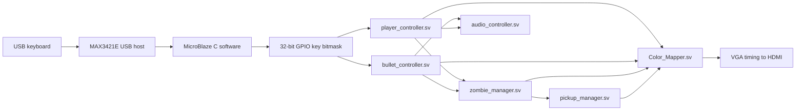

# Project Outbreak

Two-player FPGA zombie survival game for ECE 385.

Project Outbreak is a top-down survival game built on FPGA hardware. Two local
players share a scrolling screen, move through a large tile map, shoot zombies,
pick up weapons and health packs, and try to survive as long as possible.

## At a Glance

| Area | Summary |
| --- | --- |
| Platform | MicroBlaze software plus SystemVerilog hardware |
| Display | VGA timing converted to HDMI output |
| Input | USB keyboard through the MAX3421E controller |
| Players | Two local players on one shared camera |
| World | 128 x 128 tile map, rendered as a 2048 x 2048 world |
| Enemies | Ten zombie slots with chase, health, damage, and respawn behavior |
| Audio | PWM sound effects for shooting and damage feedback |

## Controls

| Player | Move Up | Move Down | Move Left | Move Right | Shoot |
| --- | --- | --- | --- | --- | --- |
| Player 1 | `W` | `S` | `A` | `D` | `Space` |
| Player 2 | `I` | `K` | `J` | `L` | `Enter` |

The keyboard software packs these keys into a 32-bit bitmask and exposes it to
the hardware through GPIO.

| Bit | Key | Meaning |
| --- | --- | --- |
| 0 | `W` | Player 1 up |
| 1 | `S` | Player 1 down |
| 2 | `A` | Player 1 left |
| 3 | `D` | Player 1 right |
| 4 | `Space` | Player 1 shoot |
| 8 | `I` | Player 2 up |
| 9 | `K` | Player 2 down |
| 10 | `J` | Player 2 left |
| 11 | `L` | Player 2 right |
| 12 | `Enter` | Player 2 shoot |

## Gameplay Features

### Players and Camera

- Two players start with revolvers and independent health bars.
- The shared camera follows the midpoint of the living players.
- Dead players stop moving and shooting, while surviving players remain active.
- Damage uses short invincibility frames to avoid instant repeated hits.

### Zombies

- Zombies chase the closest living player.
- Each zombie has its own position, health, hit detection, and damage output.
- A kill counter increments when zombies die.
- The game-over overlay appears when both players reach zero health.

### Weapons

| Weapon | Behavior |
| --- | --- |
| Revolver | Single shot on each press |
| Shotgun | Five short-range pellets per shot |
| Uzi | Automatic fire while the shoot key is held |

Weapon drops are placed on the map. Either player can collect a drop by
overlapping it.

### Pickups

- Health pickups can spawn when zombies die.
- Up to five health pickups can be active at once.
- A pickup heals the first living player who overlaps it.

### World and Rendering

- The world is a 128 x 128 tile map.
- Tiles include grass, roads, fences, buildings, trees, houses, and props.
- Sprite ROMs and palette modules are generated from image assets.
- Green chroma key is treated as transparent in sprite rendering.

## Architecture

Hardware game state updates are synchronized to the frame tick derived from
`vsync`. Rendering reads the latest player, zombie, bullet, pickup, and UI state
to choose the final RGB value for each pixel.

## Source Guide

### Hardware

| File | Role |
| --- | --- |
| `mb_usb_hdmi_top.sv` | Top-level integration for MicroBlaze, HDMI, controllers, rendering, pickups, and audio |
| `player_controller.sv` | Player movement, camera, health, damage, direction, and weapon pickup state |
| `bullet_controller.sv` | Bullet spawning, movement, lifetime, weapon behavior, wall collision, and shot audio pulses |
| `zombie_manager.sv` | Owns the ten zombie slots and combines zombie hit and damage signals |
| `zombie_controller.sv` | Controls one zombie, including spawn, target selection, movement, health, and bullet collision |
| `pickup_manager.sv` | Spawns health pickups from zombie deaths and emits heal pulses on collection |
| `Color_Mapper.sv` | Builds the tile map, reads sprite ROMs, handles transparency, draws UI, and outputs RGB |
| `VGA_controller.sv` | Generates 640 x 480 VGA timing signals |
| `game_over_overlay.sv` | Draws the end screen and final score when both players are dead |
| `audio_controller.sv` | Reads sound samples from ROM and generates PWM audio |
| `hex_driver.sv` | Drives the board hex displays |

### Software

| File | Role |
| --- | --- |
| `software/lw_usb_main.c` | Main USB polling loop and keyboard bitmask output |
| `software/lw_usb/MAX3421E.c` | SPI driver for the MAX3421E USB host controller |
| `software/lw_usb/HID.c` | HID keyboard report parsing |
| `software/lw_usb/project_config.h` | USB and hardware configuration constants |

### Assets

| Path | Contents |
| --- | --- |
| `Image_to_COE-master/*/*.COE` | Generated memory initialization files for sprite ROMs |
| `Image_to_COE-master/*/*_palette.sv` | Generated palette modules used by the renderer |

## Build Notes

1. Open the hardware project in Vivado.
2. Add the SystemVerilog modules from the repository.
3. Add the generated sprite ROM and palette modules.
4. Generate the bitstream.
5. Export the hardware design to Vitis.
6. Build and run `software/lw_usb_main.c`.
7. Connect a keyboard through the MAX3421E USB host port.

## Starting Points

For a quick code tour, start with these files in order:

1. `mb_usb_hdmi_top.sv`
2. `software/lw_usb_main.c`
3. `player_controller.sv`
4. `bullet_controller.sv`
5. `zombie_manager.sv`
6. `Color_Mapper.sv`
